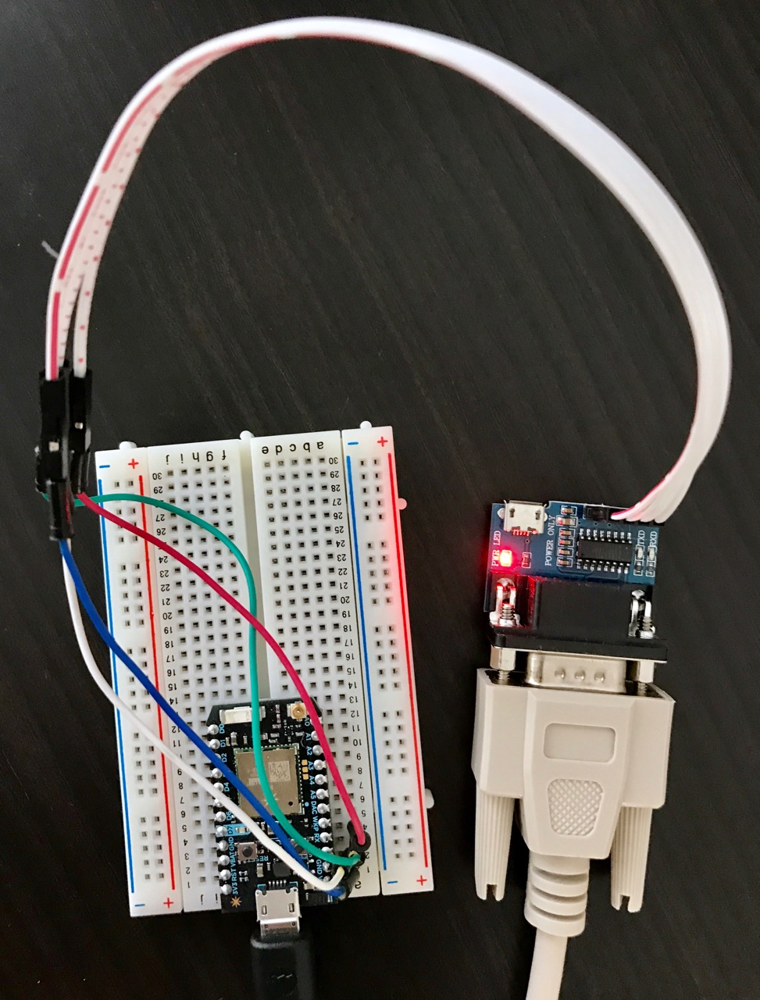

# epson-projector-remote

A simple EPSON projector remote via RS232 running on an ESP8266.

This is not intended to be as exhaustive as openHAB's addon. The plan is to have a small feature set of just powering on and off, as (sadly) more than that is not yet supported by Apple's HomeKit. This small project is just a relais to use with my [homebridge particle.io plugin](https://github.com/norman-thomas/homebridge-particle-io) so I can turn on my projector via Siri.

This was tested using an EPSON EH-TW4400 projector.

# Setup

## Equipment

* ESP8266 compatible controller
* EPSON projector (EH-TW 4400, in my case)
* RS232 interface (MAX3232 chip)
* 4 jumper wires

## Wiring

The Wiring is very straight-forward. Simply connect the following pins from your controller to the MAX3232 (RS232) board:

* `Vin`—`Vcc`
* `GND`—`GND`
* `RX`—`TXD`
* `TX`—`RXD`

Just pay attention to really connect the RX(D) with TX(D) and vice versa.

# Commands

The functions listed below are exposed via MQTT topics.

* `.../devices/projector/power`, depending on the payload it will either turn on or turn off the projector or request the current power status
  * if payload is `1` or `on` the projector will be powered on
  * if payload is `0` or `off` the projector will be powered off
  * if payload is `?` or empty the projector will be publish a topic with its current power status. This is equivalent to the next topic below.
* `.../devices/projector/refresh` asks the projector to publish a topic with its current power status

I disabled the default behavior of the LEDs on the ESP8266 and serial board. They are constantly turned off. While sending a command it briefly turns red.

# Resources

[EPSON Business Projector Documentation](https://files.support.epson.com/Epson_Handbook/html/p85_rs232.html)

[EPSON Home Projector Documentation](https://epson.com/Support/wa00572)

[openHAB Addon](https://github.com/openhab/openhab1-addons/tree/master/bundles/binding/org.openhab.binding.epsonprojector)

